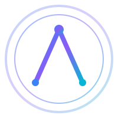

<p align="center">
  
</p>

<h1 align="center">verenajs</h1>

<p align="center">
  <strong>The Vanilla JavaScript Framework for Real Applications</strong>
</p>

<p align="center">
  No React. No Virtual DOM. Pure Performance.
</p>

<p align="center">
  <a href="https://github.com/muslihabdiker/vplusplus/actions"></a>
  <a href="https://www.npmjs.com/package/verenajs"></a>
  <a href="LICENSE"></a>
  
  <a href="https://github.com/muslihabdiker/vplusplus/stargazers"></a>
</p>

<p align="center">
  <a href="#installation">Installation</a> •
  <a href="#quick-start">Quick Start</a> •
  <a href="#features">Features</a> •
  <a href="#documentation">Documentation</a> •
  <a href="#contributing">Contributing</a>
</p>

---

## What is verenajs?

verenajs is a **complete application framework** that compiles to **Web**, **Mobile**, and **Desktop** from a single codebase. Built on vanilla JavaScript with zero framework overhead.

Think **Qt + Svelte + WordPress** — not React.

```javascript
import { createButton, createCard, Router } from 'verenajs';

// Pure DOM - no virtual DOM overhead
const button = createButton({
  type: 'primary',
  label: 'Get Started',
  onClick: () => alert('Welcome to verenajs!')
});

document.body.appendChild(button);
```

---

## Installation

### npm

```bash
npm install verenajs
```

### yarn

```bash
yarn add verenajs
```

### pnpm

```bash
pnpm add verenajs
```

### CDN

```html
<script type="module">
  import verenajs from 'https://unpkg.com/verenajs@2.0.0/index.js';
</script>
```

### Requirements

- Node.js 18+
- Modern browser (Chrome 90+, Firefox 88+, Safari 14+, Edge 90+)

---

## Quick Start

### 1. Create a new project

```bash
mkdir my-app && cd my-app
npm init -y
npm install verenajs
```

### 2. Create your first component

```javascript
// index.js
import {
  createButton,
  createCard,
  createInput,
  theme,
  store
} from 'verenajs';

// Set theme
theme.set('dark');

// Create a login card
const loginCard = createCard({ title: 'Welcome Back' });

const emailInput = createInput({
  label: 'Email',
  type: 'email',
  placeholder: 'you@example.com'
});

const passwordInput = createInput({
  label: 'Password',
  type: 'password',
  placeholder: '••••••••'
});

const loginButton = createButton({
  type: 'primary',
  label: 'Sign In',
  onClick: () => {
    console.log('Logging in...');
  }
});

// Build the UI
loginCard.appendChild(emailInput);
loginCard.appendChild(passwordInput);
loginCard.appendChild(loginButton);

document.getElementById('app').appendChild(loginCard);
```

### 3. Add to HTML

```html
<!DOCTYPE html>
<html>
<head>
  <title>My verenajs App</title>
</head>
<body>
  <div id="app"></div>
  <script type="module" src="index.js"></script>
</body>
</html>
```

### 4. Run with a dev server

```bash
npx serve .
```

---

## Features

### 257+ Production Components

Every component you need, ready to use:

```javascript
import {
  // Layout
  createContainer, createGrid, createStack, createSplitter,

  // Forms
  createInput, createButton, createCheckbox, createSelect,
  createDatePicker, createFileUploader, createRichTextEditor,

  // Display
  createCard, createModal, createAlert, createTooltip,
  createBadge, createAvatar, createSkeleton,

  // Data
  createTable, createDataTable, createList, createTreeView,

  // Charts
  createLineChart, createBarChart, createPieChart,

  // Trading
  createOrderBook, createMarketChart, createTradeHistory
} from 'verenajs';
```

### Visual Builder

Build UIs with drag-and-drop:

```javascript
import { toggleBuilder } from 'verenajs/builder';

// Press Ctrl+B or call programmatically
toggleBuilder();
```

<details>
<summary>Visual Builder Features</summary>

- Drag-and-drop component palette
- Live preview
- Property inspector
- Undo/redo history
- Export to code
- Keyboard shortcuts

</details>

### Multi-Platform Compiler

One codebase, three platforms:

```bash
# Build for web
npm run build:web

# Build for mobile (iOS/Android)
npm run build:mobile

# Build for desktop (Windows/macOS/Linux)
npm run build:desktop

# Build for all platforms
npm run build:all
```

### State Management

Built-in reactive store:

```javascript
import { store, events } from 'verenajs';

// Set state
store.setState({ user: null, theme: 'dark' });

// Subscribe to changes
store.subscribe((state, prev) => {
  console.log('State changed:', state);
});

// Event bus
events.on('user:login', (user) => {
  store.setState({ user });
});

events.emit('user:login', { name: 'John' });
```

### Theming

Runtime theming with design tokens:

```javascript
import { theme } from 'verenajs';

// Switch themes
theme.set('dark');

// Get tokens
const primary = theme.get('primary'); // #3b82f6

// Custom themes
theme.extend('brand', {
  primary: '#8b5cf6',
  secondary: '#06b6d4',
  background: '#0f172a'
});
```

### Routing

Full-featured router:

```javascript
import { Router } from 'verenajs';

const router = new Router({
  routes: [
    { path: '/', component: HomePage },
    { path: '/dashboard', component: Dashboard, guard: authGuard },
    { path: '/users/:id', component: UserProfile },
    { path: '*', component: NotFound }
  ]
});

// Navigate programmatically
router.navigate('/dashboard');

// Access params
router.on('routeChange', ({ params }) => {
  console.log('User ID:', params.id);
});
```

### ZeroMQ Communication

Real-time messaging for advanced applications:

```javascript
import zmq from 'verenajs/core/zeromq';

await zmq.initialize({ wsUrl: 'ws://localhost:5555' });

// Pub/Sub
const channel = await zmq.createChannel('notifications');
channel.subscribe('alert', (data) => console.log(data));
channel.publish('alert', { message: 'Hello!' });
```

### Qt Bridge (Desktop)

Native desktop performance:

```javascript
import { initQtBridge, QtDialogs, QtWindow } from 'verenajs/core/bridges/qt';

await initQtBridge();

// Native file dialog
const file = await QtDialogs.openFile({
  filters: [{ name: 'Images', extensions: ['jpg', 'png'] }]
});

// Window controls
QtWindow.maximize();
QtWindow.setTitle('My App');
```

### OpenCV Integration

Visual processing and layout intelligence:

```javascript
import OpenCV from 'verenajs/core/opencv';

// Recognize hand-drawn layouts
const components = await OpenCV.recognizeLayout(sketchImage);

// Parse design files
const tree = await OpenCV.parseDrawIO(xmlContent);
```

---

## Usage Examples

### Creating a Dashboard

```javascript
import {
  createContainer,
  createGrid,
  createCard,
  createStat,
  createLineChart,
  createDataTable
} from 'verenajs';

const dashboard = createContainer({ className: 'dashboard' });

// Stats row
const statsGrid = createGrid({ columns: 4, gap: '1rem' });
statsGrid.appendChild(createStat({ label: 'Users', value: '12,543' }));
statsGrid.appendChild(createStat({ label: 'Revenue', value: '$45,231' }));
statsGrid.appendChild(createStat({ label: 'Orders', value: '1,234' }));
statsGrid.appendChild(createStat({ label: 'Growth', value: '+12.5%' }));

// Chart
const chartCard = createCard({ title: 'Revenue Over Time' });
chartCard.appendChild(createLineChart({ data: revenueData }));

// Table
const tableCard = createCard({ title: 'Recent Orders' });
tableCard.appendChild(createDataTable({
  columns: ['Order', 'Customer', 'Amount', 'Status'],
  data: ordersData
}));

dashboard.appendChild(statsGrid);
dashboard.appendChild(chartCard);
dashboard.appendChild(tableCard);

document.body.appendChild(dashboard);
```

### Building a Form

```javascript
import {
  createSmartForm,
  createInput,
  createSelect,
  createButton,
  createCard
} from 'verenajs';

const form = createSmartForm({
  onSubmit: (data) => {
    console.log('Form data:', data);
  }
});

form.appendChild(createInput({
  name: 'fullName',
  label: 'Full Name',
  required: true
}));

form.appendChild(createInput({
  name: 'email',
  label: 'Email',
  type: 'email',
  required: true
}));

form.appendChild(createSelect({
  name: 'role',
  label: 'Role',
  options: [
    { value: 'developer', label: 'Developer' },
    { value: 'designer', label: 'Designer' },
    { value: 'manager', label: 'Manager' }
  ]
}));

form.appendChild(createButton({
  type: 'primary',
  label: 'Submit'
}));

document.body.appendChild(form);
```

### Trading Application

```javascript
import {
  createOrderBook,
  createMarketChart,
  createTradeHistory,
  createOrderForm,
  createGrid
} from 'verenajs';

const tradingLayout = createGrid({ columns: 3 });

// Order book
tradingLayout.appendChild(createOrderBook({
  symbol: 'BTC/USD',
  bids: bidData,
  asks: askData
}));

// Chart
tradingLayout.appendChild(createMarketChart({
  symbol: 'BTC/USD',
  data: priceHistory,
  type: 'candlestick'
}));

// Trade panel
const tradePanel = createContainer();
tradePanel.appendChild(createOrderForm({ symbol: 'BTC/USD' }));
tradePanel.appendChild(createTradeHistory({ trades: recentTrades }));
tradingLayout.appendChild(tradePanel);

document.body.appendChild(tradingLayout);
```

---

## Documentation

| Document | Description |
|----------|-------------|
| [Architecture](ARCHITECTURE.md) | System design and internals |
| [Installation](INSTALLATION.md) | Detailed setup guide |
| [Usage](USAGE.md) | API reference and patterns |
| [Examples](EXAMPLES.md) | Code examples and tutorials |
| [Contributing](CONTRIBUTING.md) | How to contribute |
| [Changelog](CHANGELOG.md) | Version history |
| [Roadmap](ROADMAP.md) | Future plans |

---

## Project Structure

```
verenajs/
├── core/                    # Core runtime
│   ├── core.js             # Events, store, theme, DOM utils
│   ├── registry.js         # Component auto-discovery
│   ├── zeromq.js           # ZeroMQ communication
│   ├── opencv.js           # OpenCV integration
│   └── bridges/qt.js       # Qt native bridge
├── components/              # 257 UI components
├── builder/                 # Visual Builder
├── compiler/                # Multi-target compiler
│   └── generators/         # Platform generators
└── index.js                 # Main exports
```

---

## Browser Support

| Browser | Version |
|---------|---------|
| Chrome | 90+ |
| Firefox | 88+ |
| Safari | 14+ |
| Edge | 90+ |

---

## Contributing

We welcome contributions! Please see our [Contributing Guide](CONTRIBUTING.md) for details.

```bash
# Clone the repo
git clone https://github.com/muslihabdiker/vplusplus.git

# Install dependencies
npm install

# Start dev server
npm run dev

# Run tests
npm test
```

---

## Roadmap

- [x] 257 production components
- [x] Core runtime with state management
- [x] Visual Builder
- [x] Multi-target compiler
- [x] ZeroMQ integration
- [x] Qt bridge
- [x] OpenCV integration
- [ ] TypeScript definitions
- [ ] CLI scaffolding tool
- [ ] Component marketplace
- [ ] AI-powered layout generation

See [ROADMAP.md](ROADMAP.md) for details.

---

## License

MIT License - see [LICENSE](LICENSE) for details.

---

<p align="center">
  Built with precision from Kenya 🇰🇪
</p>

<p align="center">
  <a href="https://github.com/muslihabdiker/vplusplus">GitHub</a> •
  <a href="https://www.npmjs.com/package/verenajs">npm</a> •
  <a href="https://github.com/muslihabdiker/vplusplus/issues">Issues</a>
</p>
